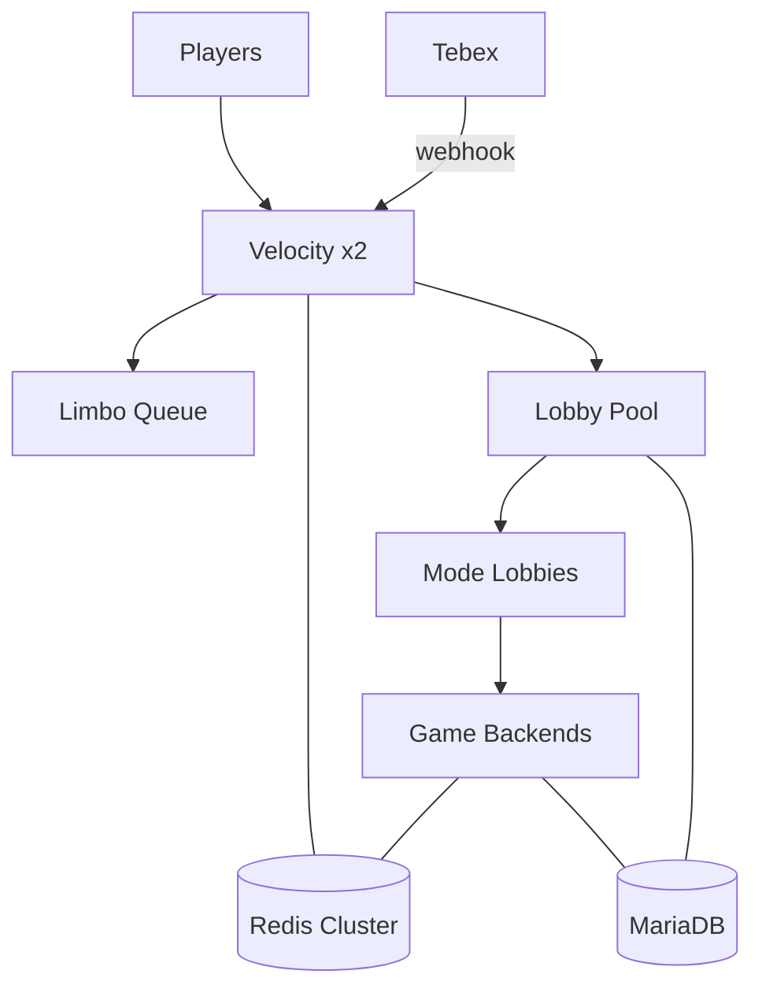

# 01 — Общая архитектура сети

## 1.1 Текстовая схема

```
Players (Java 1.20.4–1.21.x, opt. Bedrock via Geyser)
        │
        ▼
┌───────────────────┐     ┌──────────────────┐
│ Velocity Proxy    │────▶│ Limbo / Queue    │
│ Auth (online/     │     │ (when full)      │
│ offline+AuthMe)   │     └──────────────────┘
│ ViaVersion        │
│ FunnyProxy        │
└─────────┬─────────┘
          │ PlayerCreate / ServerConnected
          ▼
┌───────────────────┐
│ Main Lobby pool   │  ← default server
│ NPC + Menus       │
└─────────┬─────────┘
          │ /server or menu click
          ▼
┌─────────────────────────────────────────────────────┐
│ Mode Lobby (unique world + theme)                   │
│ Survival | Anarchy | SB | BW | SW | SP | HG | ...   │
└─────────┬───────────────────────────────────────────┘
          │ matchmake / transfer
          ▼
┌─────────────────────────────────────────────────────┐
│ Game backends (isolated sync_group per mode)        │
└─────────────────────────────────────────────────────┘
          │
    ┌─────┴──────┐
    ▼            ▼
 Redis Cluster   MariaDB (global + mode schemas)
```

## 1.2 Потоки данных

### A. Login

1. Client → Velocity (modern forwarding).
2. Если online-mode=false (пират) — AuthMe на Lobby + session Redis `auth:{uuid}` TTL 12h.
3. FunnyProxy грузит global profile из Redis; miss → MySQL → cache.
4. Send to least-loaded `lobby-*`.

### B. Transfer Lobby → Mode

1. DeluxeMenus click → `funny transfer <mode>`.
2. FunnyProxy: queue slot check → pick backend.
3. Save nothing inventory-global; only update `last_mode`.
4. On join mode server: load mode-local inventory from `FunnySync` group=`mode`.

### C. Match end (BedWars)

1. Arena plugin computes rating delta + FunnyCoins reward.
2. Write rewards async to MySQL (`funny_coins` += n, stats).
3. Wipe match inventory; send to mode lobby.
4. Pub/sub `funny:stats` for leaderboards.

### D. Donate

1. Tebex payment → webhook / plugin command on proxy or lobby.
2. `lp user <name> parent add <rank>` + `funnycoins give` + `ec keys give`.
3. Redis invalidate profile cache.

## 1.3 Sync groups (критично)

| Sync group | Servers | Syncs |
|------------|---------|-------|
| `global-meta` | ALL | rank, coins, cosmetics, titles, clan (via FunnyCore) |
| `surv` | surv-* | inventory, ender, xp, location |
| `ana` | ana-* | inventory, ender, xp |
| `sb` | sb-* | inventory, ender, island link |
| `prison` | prison-* | inventory, mine rank |
| `farm` | farm-* | inventory |
| `creative` | creative-* | inventory (plots separate) |
| `minigame` | arena servers | **NO persist inventory** between matches |

HuskSync / FunnySync: `sync-inventories: true` only inside group. Cross-group = disabled.

## 1.4 Network ports (пример)

| Service | Port | Bind |
|---------|------|------|
| Velocity public | 25565 | 0.0.0.0 |
| Velocity query | 25565 | — |
| Lobby-01 | 25566 | 10.0.0.0/8 only |
| Surv-01 | 25570 | private |
| Redis | 6379 | private + ACL |
| MariaDB | 3306 | private |
| Prometheus | 9090 | VPN |

Backends **never** public.

## 1.5 Velocity routing rules

```
try = ["lobby-01", "lobby-02", "lobby-03"]
forced hosts:
  surv.funnynetwork.net → ["lb-surv"]
  bw.funnynetwork.net → ["lb-bw"]
  fl.funnynetwork.net → ["lobby-01"]   # FunnyMC-style second IP
```

## 1.6 Folder layout (полный)

```
/opt/funny/
├── proxy/
│   ├── velocity.jar
│   ├── velocity.toml
│   ├── forwarding.secret
│   ├── plugins/
│   │   ├── funnymproxy/
│   │   ├── luckperms/
│   │   ├── viaversion/
│   │   ├── maintenance/
│   │   └── ...
│   └── logs/
├── servers/
│   ├── lobby-01/ ... paper/purpur + plugins
│   ├── lb-surv/
│   ├── surv-01/
│   ├── lb-bw/
│   ├── bw-arena-01/
│   └── ...
├── shared/
│   ├── resourcepack/funny-pack.zip
│   ├── menus/                 # rsync to DeluxeMenus
│   ├── holograms/
│   └── schematics/
├── secrets/
│   ├── db.env                 # chmod 600
│   └── tebex.env
├── data/
│   ├── mariadb/
│   └── redis/
└── scripts/
```

## 1.7 Process model

- One JVM per server instance.
- `start-paper.sh` → `tmux`/`systemd`/`Pterodactyl`.
- Graceful stop: `end` / `stop` with 30s drain; proxy marks server offline via Redis heartbeat.

## 1.8 Environments

| Env | Purpose |
|-----|---------|
| `dev` | 1 proxy + 1 lobby + 1 surv + 1 bw |
| `stage` | Full mode set, 10% traffic bots |
| `prod` | Full scale |

Config via env: `FUNNY_ENV`, `FUNNY_SERVER_ID`, `FUNNY_SYNC_GROUP`.

## 1.9 Mermaid (для Confluence/Notion)



## 1.10 Security baseline

- Firewall: only 25565 public.
- Secrets not in git; use `secrets/*.env`.
- LuckPerms editor restricted; web editor VPN-only.
- RCON bound to localhost or disabled; use Velocity panel.
- Backups: MariaDB binlog + daily dump; world zstd every 6h for survival-like.
